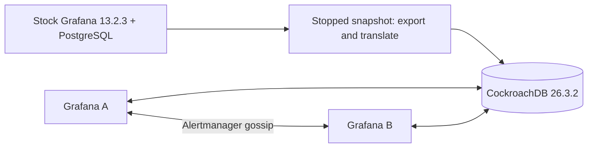

# Grafana with CockroachDB — pinned multi-instance prototype

This fork adds experimental support for **CockroachDB 26.3.2 as Grafana OSS 13.2.3's internal configuration and state database**. It supports two Grafana instances sharing the same manually bootstrapped database. Normal PostgreSQL/MySQL/SQLite behavior remains the default; the CRDB path is explicitly enabled.

## What changed

- **Read-only startup verification:** every registered migrator requires successful records from a matching external bootstrap. Missing schema or migration records stop startup. Grafana does not execute migrations on CRDB or rely on PostgreSQL advisory locks.
- **Runtime SQL compatibility:** ordered/limited update, delete, and soft-delete operations use CRDB's native SQL instead of PostgreSQL `CTID`. This fixes Alertmanager's applied-configuration history update.
- **Transaction conflicts:** legacy and unified-storage callback transactions retry SQLSTATE `40001`, including commit failures. Ambiguous outcomes and unrelated errors are not automatically replayed.
- **Concurrent startup:** a node waits, with a timeout, for another node's basic-role seeding lock instead of exiting or skipping permissions.
- **Multi-instance configuration:** the example shares database state and the security secret, with private Alertmanager gossip peers.

## Manual bootstrap and operation

A stock, pinned Grafana 13.2.3 process first completes its migrations on PostgreSQL. Stop that process, export its schema/data, translate the supported PostgreSQL metadata, and import it into a fresh CRDB database. The helper verifies all source table counts, index names, and migration records before either runtime node starts. PostgreSQL is used for bootstrap only.



See [the complete build, bootstrap, test, and teardown guide](contrib/crdb-prototype/README.md). The build retains the pinned upstream frontend and bundled plugins, replacing the backend and defaults with this fork.

Build locally from this checkout:

```sh
docker build -f contrib/crdb-prototype/Dockerfile -t grafana-crdb-prototype:13.2.3 .
python contrib/crdb-prototype/bootstrap.py
```

The published standard image is [`h01001000/grafana-crdb:13.2.3-prototype.1`](https://hub.docker.com/r/h01001000/grafana-crdb/tags), matching upstream's CPU platforms: `linux/amd64`, `linux/arm64`, and `linux/arm/v7`. Its verified immutable index digest is `sha256:7979d80f68422db691525297b4978b14381a51d88c7f872464ecca54d25d12d2`.

For the published image, set `GRAFANA_CRDB_IMAGE` to that versioned reference before running the helper. The example binds Grafana A/B to localhost ports 13401/13402. It uses disposable credentials and an insecure database isolated on a private Docker network; it is a local test setup.

Required application configuration:

```ini
[database]
type = postgres
cockroachdb_manual_bootstrap = true
skip_migrations = false
```

Use the same `security.secret_key` on both instances and during bootstrap. The helper preserves existing encryption metadata and configures `autocommit_before_ddl=off` and `create_table_with_schema_locked=off` for the dedicated database role.

## Verified prototype scope

The pinned prototype has passed the targeted backend suite, real-CRDB ordered/limited write and serialization-retry tests, and the local acceptance scenarios below:

- simultaneous startup of both Grafana instances;
- shared login cookie and preferences, cross-node writes, and 40 concurrent dashboard creations/readbacks through opposite nodes;
- datasource configuration/encrypted credential fields and folder/dashboard/paused-alert CRUD;
- unified resource updates with changing resource versions;
- refusal of empty or incomplete bootstrap state without automatic migration writes;
- two-member Alertmanager gossip, one webhook notification with both peers, and delivery of a new firing alert by B after A stops.

The notification fixture runs only on the private local network. `test_notifications.py` and `acceptance.yaml` provide it. Backend and integration tests live beside the affected code; the standard API suite and multi-instance scripts are in `contrib/crdb-prototype/`.

## Limits and upgrade policy

This is a prototype pinned to one Grafana release, not complete upstream CRDB support. It does not perform automatic CRDB schema upgrades. A future release requires all writers to stop and a separately validated migration/transfer procedure that preserves existing data. The empty-database helper is not an upgrade procedure for a populated deployment.

Callback retries do not add replay support to direct streaming/bulk transaction APIs. The collation translation needs broader semantic coverage. The two-instance test uses one local CRDB node and does not establish multi-region partition/failover safety, global exactly-once notification delivery, or every Grafana subsystem's HA behavior. Grafana Live streaming is not clustered by merely sharing this database. The exposed resource watch endpoint returned HTTP 405, so watch delivery is not claimed.

---

## Upstream Grafana


The open-source platform for monitoring and observability

[](LICENSE)

Grafana allows you to query, visualize, alert on and understand your metrics no matter where they are stored. Create, explore, and share dashboards with your team and foster a data-driven culture:

- **Visualizations:** Fast and flexible client side graphs with a multitude of options. Panel plugins offer many different ways to visualize metrics and logs.
- **Dynamic Dashboards:** Create dynamic & reusable dashboards with template variables that appear as dropdowns at the top of the dashboard.
- **Explore Metrics:** Explore your data through ad-hoc queries and dynamic drilldown. Split view and compare different time ranges, queries and data sources side by side.
- **Explore Logs:** Experience the magic of switching from metrics to logs with preserved label filters. Quickly search through all your logs or streaming them live.
- **Alerting:** Visually define alert rules for your most important metrics. Grafana will continuously evaluate and send notifications to systems like Slack, PagerDuty, VictorOps, OpsGenie.
- **Mixed Data Sources:** Mix different data sources in the same graph! You can specify a data source on a per-query basis. This works for even custom datasources.

## Get started

- [Get Grafana](https://grafana.com/get)
- [Installation guides](https://grafana.com/docs/grafana/latest/setup-grafana/installation/)

Unsure if Grafana is for you? Watch Grafana in action on [play.grafana.org](https://play.grafana.org/)!

## Documentation

The Grafana documentation is available at [grafana.com/docs](https://grafana.com/docs/).

## Contributing

If you're interested in contributing to the Grafana project:

- Start by reading the [Contributing guide](https://github.com/grafana/grafana/blob/HEAD/CONTRIBUTING.md).
- Learn how to set up your local environment, in our [Developer guide](https://github.com/grafana/grafana/blob/HEAD/contribute/developer-guide.md).
- Explore our [beginner-friendly issues](https://github.com/grafana/grafana/issues?q=is%3Aopen+is%3Aissue+label%3A%22beginner+friendly%22).
- Look through our [style guide and Storybook](https://developers.grafana.com/ui/latest/index.html).

> Share your contributor experience in our [feedback survey](https://gra.fan/ome) to help us improve.

## Get involved

- Follow [@grafana on X (formerly Twitter)](https://x.com/grafana/).
- Read and subscribe to the [Grafana blog](https://grafana.com/blog/).
- If you have a specific question, check out our [discussion forums](https://community.grafana.com/).
- For general discussions, join us on the [official Slack](https://slack.grafana.com) team.

This project is tested with [BrowserStack](https://www.browserstack.com/).

## License

Grafana is distributed under [AGPL-3.0-only](LICENSE). For Apache-2.0 exceptions, see [LICENSING.md](https://github.com/grafana/grafana/blob/HEAD/LICENSING.md).

